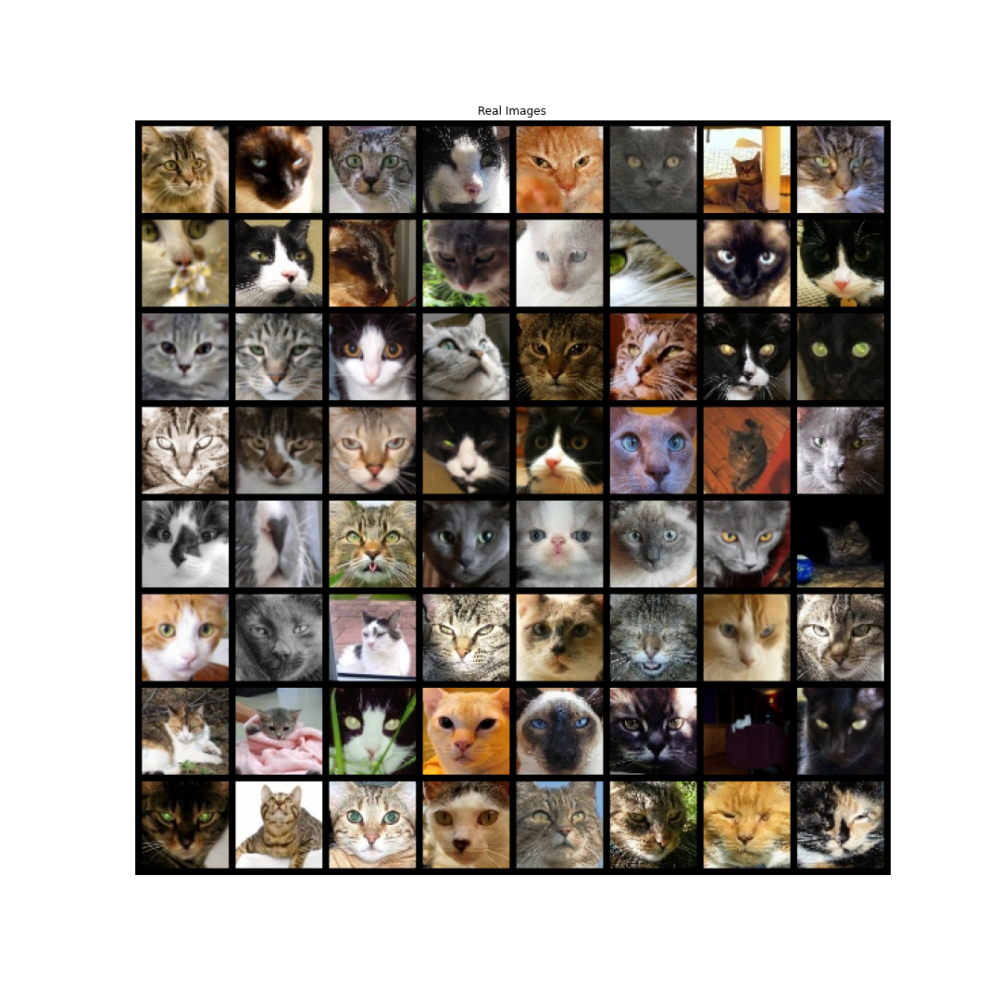
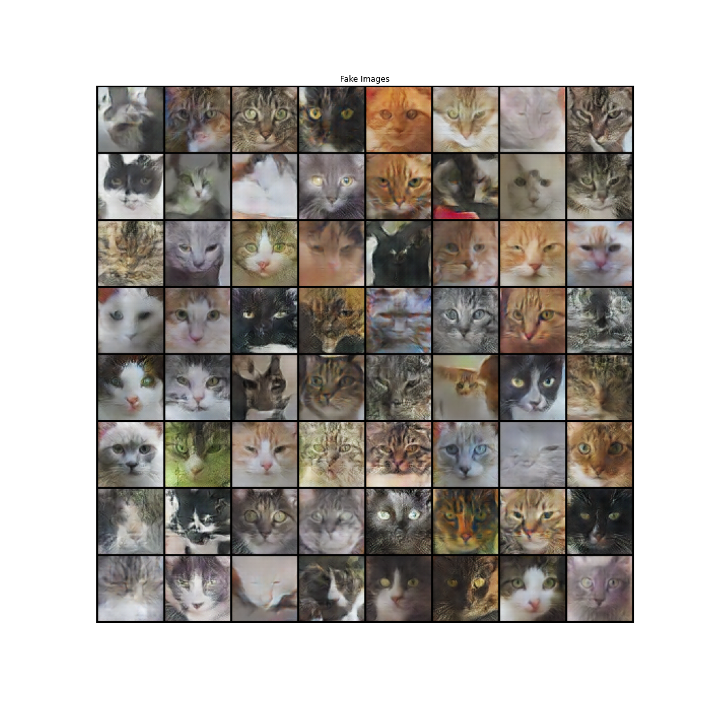

# CAT GENERATOR

A Deep Convolutional GAN [[original paper]](https://arxiv.org/pdf/1511.06434.pdf) trained on [Cat-faces-dataset](https://github.com/Ferlix/Cat-faces-dataset). The dataset has 30k pictures of cats of size 64x64, and each image contains only the face of the cats.

  

The GAN was implemented in PyTorch from [DCGAN TUTORIAL](https://pytorch.org/tutorials/beginner/dcgan_faces_tutorial.html).

- `cat_generator.ipynb` GAN training and results visualization.
- `mygan.py` custom classes.

The DCGAN converges to realistic pictures with only 50 epochs (already overkilling without at least one or two GPUs), but some more hyperparameters tuning (and more epochs!) could lead to better results. Despite there being a [mode collapse](https://aiden.nibali.org/blog/2017-01-18-mode-collapse-gans/) in some of the images generated, I ended up with some really nice fake cats.

  

